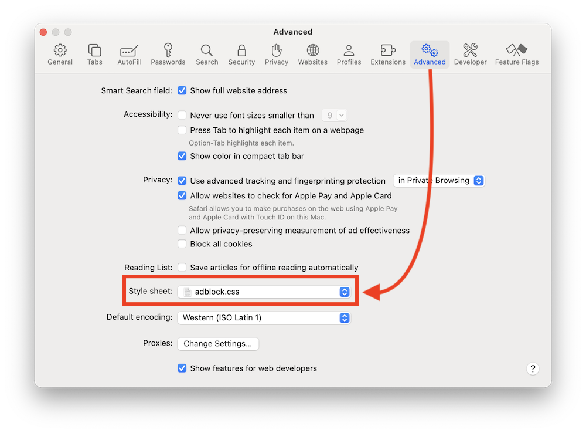

# adblock.css
Safari user agent stylesheet to block annoying stuff

## Usage

Download <a href="https://raw.githubusercontent.com/catskull/adblock.css/main/adblock.css" download>adblock.css</a>
(I put mine in iCloud Drive)

Safari -> Settings -> Advanced Tab -> Style Sheet

Note: if you clone this repo, remove the period from the directory name. Safari will misinterprit a folder ending in ".css" as a CSS file 🤦‍♂️

## Development

Fork/clone the repo and make your changes to `base.css` (not `adblock.css`!) Run `./sync` to pull in the [easylist/fanboy](https://github.com/easylist/easylist/blob/master/fanboy-addon/fanboy_annoyance_general_hide.txt) additions, minify, and ouput a new `adblock.css`.

`./sync --watch` will watch base.css for changes and output a fresh adblock.css. Run `bundle` or `gem install listen` first!

Each time you edit and save `adblock.css`, you'll need to re-select it from the Safari Settings menu.

Submit a PR. I'll go verify your changes so please make it obvious where I can see your changes (include a link, screenshot, etc).

## License

The Unlicense

## Further reading

- This gist (included in adblock.css): https://gist.github.com/4rc0s/374163
- StopTheMadness: https://underpassapp.com/StopTheMadness/

Also check out my website: https://catskull.net/